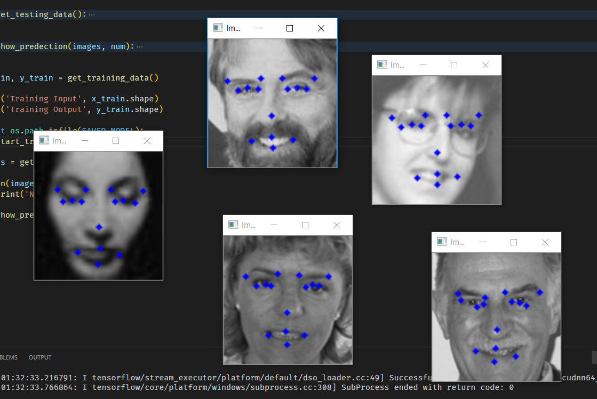

# FacialKeypoints

Find Facial Keypoints using deep learning

## Keypoints without transfer learning

## Trained On

The model is trained on GTX 1060 with Tensorflow 2.4.0 with cuda 11.0 & cudnn 8.4
